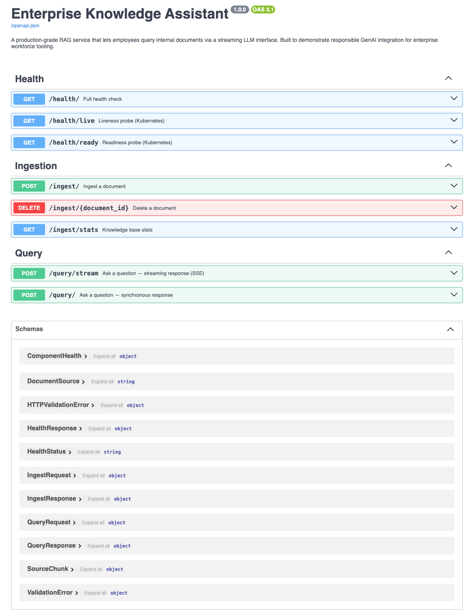
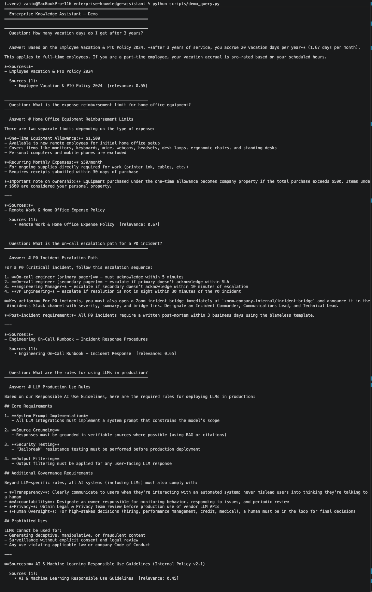
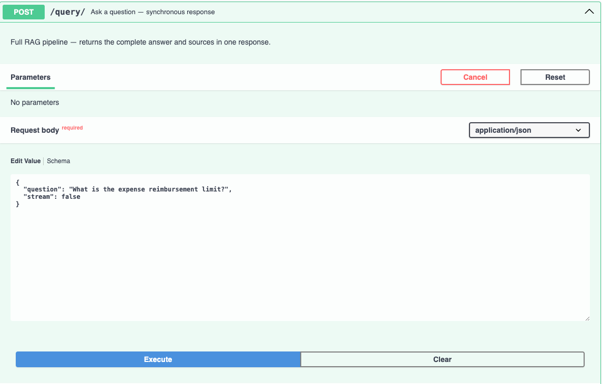
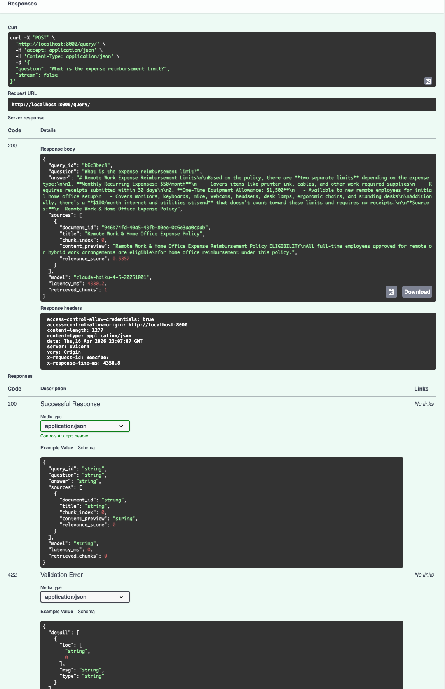
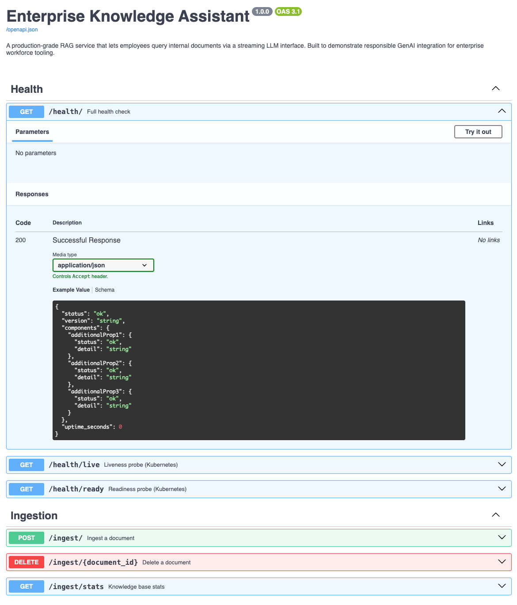

# Enterprise Knowledge Assistant

[](https://github.com/mdr391/enterprise-knowledge-assistant/actions/workflows/ci.yml)

> A production-grade RAG (Retrieval-Augmented Generation) service that lets employees
> query internal documents — policies, runbooks, wikis — via a streaming LLM interface.

This project demonstrates end-to-end GenAI integration for enterprise workforce tooling:
the same class of problem a Senior Engineer on Netflix's Employee Experience Platform
team would be chartered to solve.

---

## Why This Project Exists

Large enterprises accumulate institutional knowledge across thousands of documents —
HR policies, engineering runbooks, onboarding guides, compliance frameworks. Employees
waste significant time searching for answers that exist but are hard to find.

A naive solution is a chatbot that calls an LLM with "answer questions about our company."
That approach **hallucinates**. A production solution requires:

- **Grounded retrieval** — the LLM only sees relevant passages, not the internet
- **Responsible constraints** — explicit system prompt preventing fabrication
- **Source citations** — every answer is traceable back to a real document
- **Streaming UX** — employees see tokens as they arrive, not a 5-second blank screen
- **Observability** — structured logs, health probes, and latency tracking

This project implements all of the above.

---

## Screenshots

### Interactive API Docs (Swagger UI)


### Streaming Demo Output


### Post Query Request


### Query Response


### Health Check


---

## Architecture

```
                         ┌─────────────────────────────────────────┐
                         │           Enterprise Knowledge           │
                         │              Assistant API               │
                         │                                          │
   ┌──────────┐          │  ┌──────────────────────────────────┐   │
   │  Client  │──POST───▶│  │         FastAPI Application       │   │
   │ (Browser │          │  │   /query/stream   /query/         │   │
   │  / CLI)  │◀─ SSE ───│  │   /ingest/        /health/        │   │
   └──────────┘          │  └──────────┬───────────────────────┘   │
                         │             │                            │
                         │  ┌──────────▼──────────────────────┐   │
                         │  │         RAG Pipeline             │   │
                         │  │                                  │   │
                         │  │  1. Embed question               │   │
                         │  │     (OpenAI text-embedding-3)    │   │
                         │  │                                  │   │
                         │  │  2. Vector search                │   │
                         │  │     (ChromaDB cosine similarity) │   │
                         │  │                                  │   │
                         │  │  3. Score threshold gate         │   │
                         │  │     (drop weak matches)          │   │
                         │  │                                  │   │
                         │  │  4. Stream LLM answer            │   │
                         │  │     (Anthropic Claude)           │   │
                         │  └──────────────────────────────────┘   │
                         │                                          │
                         │  ┌──────────┐    ┌────────────────┐     │
                         │  │ChromaDB  │    │Structured Logs │     │
                         │  │(vectors) │    │  (structlog)   │     │
                         │  └──────────┘    └────────────────┘     │
                         └─────────────────────────────────────────┘
```

### Ingestion Flow

```
Document text
     │
     ▼
Sentence-aware chunking        ← Preserves context at boundaries
(512 tokens, 64 overlap)
     │
     ▼
Batch embedding                ← Single API call per document
(OpenAI text-embedding-3-small)
     │
     ▼
ChromaDB upsert                ← Cosine similarity index
(with metadata: title, tags,
  document_id, chunk_index)
```

### Query Flow

```
Question string
     │
     ▼
Embed question                 ← Cached — repeated questions cost $0
     │
     ▼
Vector search (top-K)         ← Tags filter optional
     │
     ▼
Score threshold gate           ← Weak matches dropped before LLM
     │
     ▼
Build context block            ← Numbered passages with source labels
     │
     ▼
Claude (streaming)             ← System prompt enforces grounding
     │
     ▼
SSE token stream ──────────▶  Client (token by token)
     │
     ▼
Source metadata event ──────▶ Client (after final token)
```

---

## Key Design Decisions

**1. Responsible AI by design, not by accident**

The system prompt explicitly instructs Claude to say *"I don't have enough information"*
when the retrieved context is insufficient, rather than drawing on general knowledge.
This is the primary hallucination-prevention mechanism — enforced at the prompt layer,
not post-hoc filtering.

**2. Score threshold as a hard gate**

Retrieved chunks below `RETRIEVAL_SCORE_THRESHOLD` (default: 0.35) are dropped before
the LLM sees them. Without this gate, the model receives weakly-relevant passages and
fabricates confident-sounding connections. With it, a low-confidence retrieval correctly
surfaces the "I don't know" path.

**3. Sentence-aware chunking with overlap**

Splitting on fixed character counts breaks sentences mid-thought. This implementation
accumulates complete sentences until the token budget is reached, then overlaps the
last ~64 tokens into the next chunk. This prevents context loss at chunk boundaries —
a common failure in naive RAG implementations.

**4. Batched embeddings**

Rather than embedding chunks sequentially (N API calls), the ingestion pipeline collects
all chunks and sends them in a single batched OpenAI call. For a 20-chunk document this
cuts embedding latency by ~19x and eliminates most of the per-request overhead.

**5. Adapter-friendly architecture**

The vector store and LLM layers are accessed through thin wrapper classes (`VectorStore`,
`LLMClient`, `Embedder`) rather than being called directly. This makes infrastructure
swappable without touching business logic — ChromaDB → Pinecone, OpenAI → Cohere,
Claude → GPT-4 — in one place each.

---

## Project Structure

```
enterprise_rag/
├── app/
│   ├── main.py                     ← FastAPI app, middleware, lifespan
│   ├── core/
│   │   ├── config.py               ← All settings from environment variables
│   │   ├── logging.py              ← Structured JSON logging (structlog)
│   │   ├── models.py               ← Pydantic request/response schemas
│   │   └── vector_store.py         ← ChromaDB adapter
│   ├── api/routes/
│   │   ├── query.py                ← /query/stream and /query/ endpoints
│   │   ├── ingest.py               ← /ingest/ endpoints
│   │   └── health.py               ← /health/ liveness + readiness probes
│   ├── ingestion/
│   │   └── pipeline.py             ← Chunking + embedding + storage
│   ├── retrieval/
│   │   └── rag_pipeline.py         ← Retrieval orchestration
│   └── llm/
│       ├── claude_client.py        ← Anthropic Claude (streaming + sync)
│       └── embeddings.py           ← OpenAI embeddings (batched + cached)
├── tests/
│   ├── unit/
│   │   ├── test_chunking.py        ← Chunking logic (zero external deps)
│   │   └── test_models.py          ← Pydantic validation
│   └── integration/
│       └── test_rag_pipeline.py    ← Full pipeline with mocked LLM/embeddings
├── scripts/
│   ├── seed_knowledge_base.py      ← Load sample documents via API
│   └── demo_query.py               ← Run demo queries (streaming + sync)
├── Dockerfile
├── docker-compose.yml
├── requirements.txt
├── pytest.ini
└── .env.example
```

---

## Getting Started

### Prerequisites

- Python 3.12+
- An [Anthropic API key](https://console.anthropic.com/) (Claude)
- An [OpenAI API key](https://platform.openai.com/) (embeddings only — costs ~$0.001 per document)

### 1. Clone and install

```bash
git clone https://github.com/mdr391/enterprise-knowledge-assistant.git
cd enterprise-knowledge-assistant

python -m venv .venv
source .venv/bin/activate          # Windows: .venv\Scripts\activate

pip install -r requirements.txt
```

### 2. Configure

```bash
cp .env.example .env
# Edit .env and add your API keys:
# ANTHROPIC_API_KEY=sk-ant-...
# OPENAI_API_KEY=sk-...
```

### 3. Run the API

```bash
uvicorn app.main:app --reload
```

The API starts at `http://localhost:8000`.
Interactive docs: `http://localhost:8000/docs`

### 4. Seed the knowledge base

```bash
python scripts/seed_knowledge_base.py
```

This loads 5 sample enterprise documents (HR policies, engineering runbooks, AI governance
guidelines) and confirms each was chunked and indexed.

### 5. Run demo queries

```bash
# Streaming (default) — watch tokens arrive in real time
python scripts/demo_query.py

# Single question
python scripts/demo_query.py --question "What is the on-call escalation path?"

# Non-streaming (full JSON response)
python scripts/demo_query.py --no-stream
```

---

## Running with Docker

```bash
# Build and start
docker-compose up --build

# Seed in a separate terminal
python scripts/seed_knowledge_base.py

# Query
python scripts/demo_query.py
```

ChromaDB data is persisted in a named Docker volume (`chroma_data`) so your knowledge
base survives container restarts.

---

## API Reference

### `POST /ingest/`

Ingest a document into the knowledge base.

```json
{
  "title": "Vacation Policy 2024",
  "content": "Full document text...",
  "tags": ["hr", "policy"],
  "source": "text"
}
```

Response:
```json
{
  "document_id": "a3f7c2b1-...",
  "chunks_created": 4,
  "title": "Vacation Policy 2024",
  "message": "Successfully ingested 'Vacation Policy 2024' into 4 searchable chunks."
}
```

---

### `POST /query/stream`

Ask a question — **streaming** response (Server-Sent Events).

```json
{
  "question": "How many vacation days do I get after 3 years?",
  "top_k": 5,
  "tags_filter": ["hr"]
}
```

SSE event stream:
```
data: {"token": "After"}
data: {"token": " 3"}
data: {"token": " years"}
...
data: {"sources": [{"title": "Vacation Policy 2024", "relevance_score": 0.87, ...}]}
data: [DONE]
```

---

### `POST /query/`

Ask a question — **synchronous** response.

```json
{
  "question": "What is the expense reimbursement limit?",
  "stream": false
}
```

Response:
```json
{
  "query_id": "f3a1b2c0",
  "question": "What is the expense reimbursement limit?",
  "answer": "The monthly reimbursement limit for remote work expenses is $50...\n\nSources:\n- Remote Work & Home Office Expense Policy",
  "sources": [...],
  "model": "claude-sonnet-4-20250514",
  "latency_ms": 1243.5,
  "retrieved_chunks": 3
}
```

---

### `GET /health/`

Full health check — vector store, LLM config, embeddings config.

```json
{
  "status": "ok",
  "version": "1.0.0",
  "components": {
    "vector_store": {"status": "ok", "detail": "47 chunks indexed"},
    "llm": {"status": "ok", "detail": "claude-sonnet-4-20250514"},
    "embeddings": {"status": "ok", "detail": "text-embedding-3-small"}
  },
  "uptime_seconds": 312.4
}
```

---

## Running Tests

```bash
# All tests with coverage report
pytest

# Unit tests only (no API keys needed)
pytest tests/unit/ -v

# Integration tests (mocked — no API keys needed)
pytest tests/integration/ -v
```

Tests are split into two layers:

- **Unit tests** (`tests/unit/`) — test chunking logic and schema validation with zero
  external dependencies. Fast, always runnable.
- **Integration tests** (`tests/integration/`) — test the full HTTP → RAG → LLM pipeline
  using mocked embeddings and LLM clients. ChromaDB runs in a temp directory.
  No real API calls, no API keys required.

---

## Configuration Reference

All settings are read from environment variables (or `.env`).

| Variable | Default | Description |
|---|---|---|
| `ANTHROPIC_API_KEY` | — | **Required.** Claude API key |
| `OPENAI_API_KEY` | — | **Required.** OpenAI key (embeddings only) |
| `LLM_MODEL` | `claude-sonnet-4-20250514` | Claude model to use |
| `EMBEDDING_MODEL` | `text-embedding-3-small` | OpenAI embedding model |
| `RETRIEVAL_TOP_K` | `5` | Chunks retrieved per query |
| `RETRIEVAL_SCORE_THRESHOLD` | `0.35` | Minimum cosine similarity to pass gate |
| `CHUNK_SIZE` | `512` | Target tokens per chunk |
| `CHUNK_OVERLAP` | `64` | Token overlap between consecutive chunks |
| `CHROMA_PERSIST_DIR` | `./data/chroma_db` | ChromaDB persistence path |
| `APP_ENV` | `development` | `development` or `production` (affects log format) |
| `LOG_LEVEL` | `INFO` | Logging verbosity |

---

## Production Considerations

This project is a portfolio demonstration. Here are the gaps between this and a
fully production-hardened deployment — and how to close them:

| Gap | Production approach |
|---|---|
| ChromaDB (embedded) | Replace with Pinecone, Weaviate, or pgvector for horizontal scale |
| In-memory embedding cache | Replace with Redis for multi-instance cache sharing |
| No authentication | Add OAuth2 / JWT middleware (e.g., via Okta or Auth0) |
| Single-process | Add worker concurrency via `uvicorn --workers N` or Gunicorn |
| No rate limiting | Add per-user rate limiting middleware (e.g., slowapi) |
| No async task queue | Add Celery + Redis for large document ingestion jobs |
| Local file storage | Store raw documents in S3 before chunking |

---

## Responsible AI Notes

This system is designed with the following responsible AI properties:

1. **Grounded generation** — the LLM only answers from retrieved passages, never from
   general internet knowledge, reducing hallucination risk.
2. **Explicit refusal path** — when context is insufficient, the system prompt directs
   Claude to say so rather than fabricate. The score threshold gate reinforces this.
3. **Source transparency** — every response includes citations linking the answer back
   to specific documents.
4. **No PII in vector store** — the sample documents and system are designed to handle
   policy/process content, not personal employee data.
5. **Human override** — this system is advisory. It surfaces information; it does not
   make or enforce decisions.

---

## Tech Stack

| Component | Technology | Why |
|---|---|---|
| API framework | FastAPI | Async-native, automatic OpenAPI docs, SSE support |
| LLM | Anthropic Claude | Strong instruction-following for grounded RAG |
| Embeddings | OpenAI text-embedding-3-small | High quality, low cost, 1536-dim |
| Vector store | ChromaDB | Zero-infrastructure local dev; swap to Pinecone for prod |
| Logging | structlog | Machine-readable JSON logs; Datadog-compatible |
| Validation | Pydantic v2 | Runtime schema enforcement on all I/O |
| Testing | pytest + httpx | Async-native test client with full pipeline coverage |
| Containerisation | Docker + Compose | One-command local run; production-ready image |
---

## Author

**Zahidur Rahman** — Senior ML/Platform Engineer  
[linkedin.com/in/zahidur-rahman-mdr391](https://linkedin.com/in/zahidur-rahman-mdr391)

This project is part of a portfolio demonstrating production GenAI engineering
for enterprise workforce tooling.
